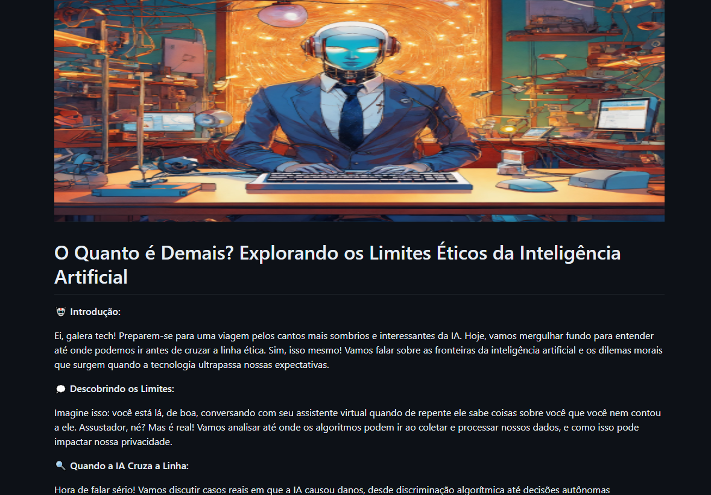

    

    
    

    

<h1 align="center">Projeto artigo técnico gerado por I.A.s</h1>

    <a href=".github/assets/artigo.md" title="View now">📕 Clique aqui para ler o artigo</a>

<h2 align="center">💻 Tecnologias utilizadas no projeto</h2>

<ul align="center">
    <li><a href="https://chat.openai.com/">ChatGPT</a> - para título e conteúdo</li>
    <li><a href="https://lexica.art/">Lexica.art</a> - para gerar imagens</li>
</ul>

<h2 align="center">📄 Prompts e ferramentas</h2>

ChatGPT：

<table align="center">
    <thead>
        <tr>
            <th>Ação</th>
            <th>Prompt</th>
        </tr>
    </thead>
    <tbody>
        <tr>
            <td>título</td>
            <td>Crie 10 headlines para nomes de artigos sobre o assunto IA ética e perigos</td>
        </tr>
        <tr>
            <td>conteúdo</td>
            <td>baseado no título "O Quanto é Demais? Explorando os Limites Éticos da Inteligência Artificial", escrevo de um artigo para uma revista de tecnologia, com uma temática menos formal</td>
        </tr>
    </tbody>
</table>

Lexica.art：

<ul align="center">
    <li>No Lexica, utilizamos o acervo público de imagens geradas por outras pessoas. Os termos de pesquisa que utilizei durante a gravação do conteúdo foram:
        <ul>
            <li>Angular</li>
        </ul>
    </li>
</ul>

<h2 align="center">✨ Features</h2>

<ul align="center">
    <li>Conteúdo gerado via ChatGPT</li>
    <li>Imagens do acervo público geradas via Lexica.art</li>
</ul>

<h2 align="center">📚 Materiais</h2>

Prompts utilizados

<h2 align="center">🛠️ Instruções de execução</h2>

Utilize os prompts acima nas ferramentas sugeridas para gerar o material base e utilize uma ferramenta de edição de documentos como PowerPoint, LibreOffice, InDesign para diagramação. O passo a passo em vídeo pode ser conferido na plataforma da <a href="https://dio.me">DIO</a>.

